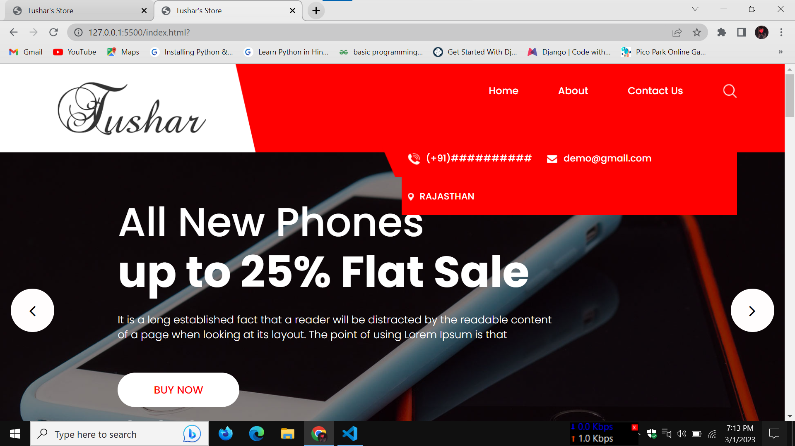
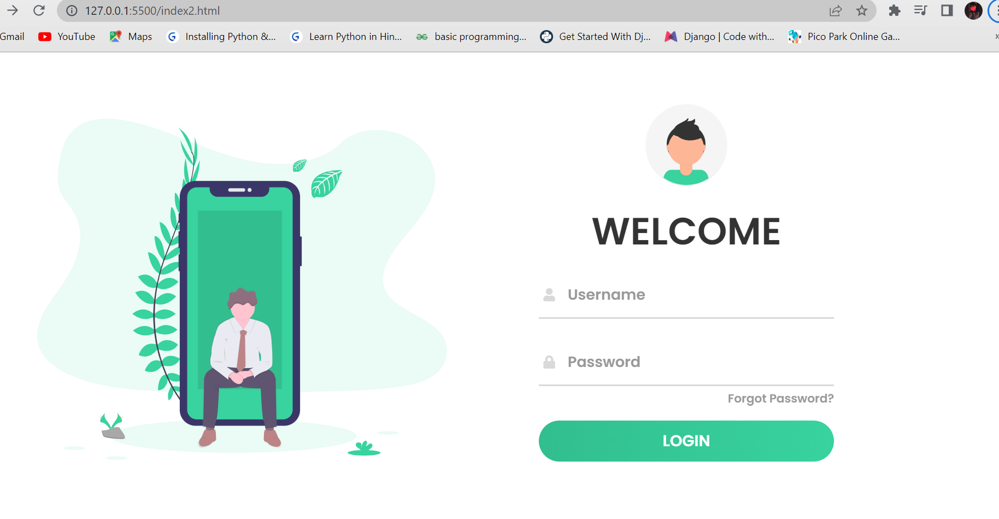
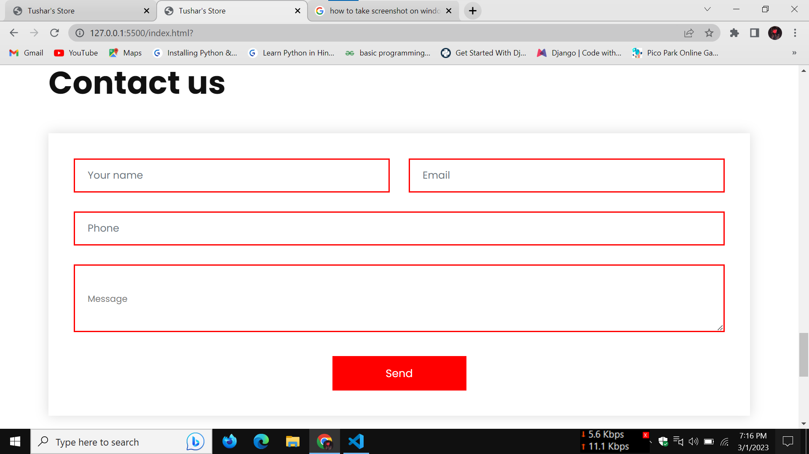

# Tushar's Store
[TAP HERE](https://sainitu.github.io/technical-task/) to see my website for this task

Website screenshot

### Welcome to my website! This is a simple Mobile selling website that I built using HTML, CSS, and JavaScript .

## Getting Started
To view this website, simply open the index2.html file in your web browser of choice. You can also visit the live website at [https://sainitu.github.io/technical-task/].

## Features
This website has the following features:

1. A home page with an introduction and links to other pages.
2. A portfolio page with examples of my devices available for sale.
3. A contact page with a contact form that will directly message details to the Gmail ID .
4. A responsive design that works well on mobile devices.
## Technologies Used
This website was built using the following technologies:

1.HTML
2.CSS
3.JavaScript

### LOGIN PAGE

### CONTACT US PAGE

## Contributing
I welcome contributions to this project! If you find any bugs or have any suggestions for improvement, please feel free to open an issue or submit a pull request.
# ADDITIONAL INFO as we were only allowed to use node/java/python/golang but still I have made an Authentication Page using OOps concepts connected with mysql using xampp server in my core strength PHP
## PLEASE HAVE A LOOK ALSO LINK OF THAT IS PROVIDED HERE (https://github.com/Sainitu/LANDING-PAGE)

### License
This project is licensed under the MIT License.
